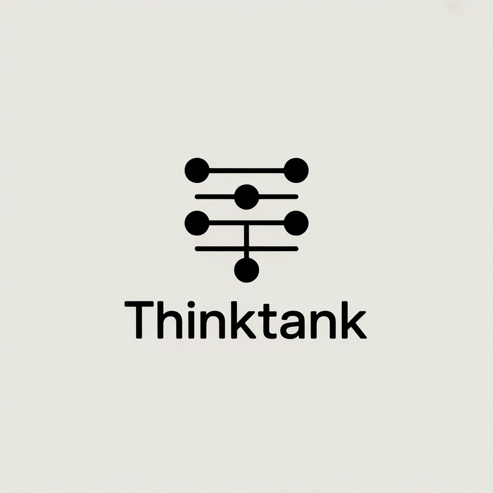

<p align="center">
  
</p>

<h3 align="center">Ensemble AI coding — multiple agents, one best answer</h3>

<p align="center">
  <a href="https://github.com/that-github-user/thinktank/actions/workflows/ci.yml"></a>
  <a href="https://github.com/that-github-user/thinktank/blob/main/LICENSE"></a>
  <a href="https://github.com/that-github-user/thinktank/releases"></a>
  <a href="https://github.com/that-github-user/thinktank/pulls"></a>
</p>

<p align="center">
  <a href="#quick-start">Quick Start</a> &middot;
  <a href="#how-it-works">How It Works</a> &middot;
  <a href="#commands">Commands</a> &middot;
  <a href="CONTRIBUTING.md">Contributing</a> &middot;
  <a href="#references">References</a>
</p>

---

Run N parallel Claude Code agents on the same task, then select the best result via test execution and **Copeland pairwise scoring**. Based on the principle that **the aggregate of independent attempts outperforms any single attempt** — proven in [ensemble ML](https://en.wikipedia.org/wiki/Ensemble_learning), [superforecasting](https://en.wikipedia.org/wiki/Superforecasting), and [LLM code generation research](#references).

## Quick start

```bash
# Install from source (npm package coming soon)
git clone https://github.com/that-github-user/thinktank.git
cd thinktank && npm install && npm run build
npm link  # makes `thinktank` available globally

# Run 3 parallel agents on a task
thinktank run "fix the authentication bypass"

# Run 5 agents with test verification
thinktank run "fix the race condition" -n 5 -t "npm test"

# Read prompt from a file (avoids shell expansion issues)
thinktank run -f task.md -n 5 -t "npm test"

# Apply the best result
thinktank apply

# Set persistent defaults
thinktank config set attempts 5
thinktank config set model opus
```

Requires [Claude Code CLI](https://docs.anthropic.com/en/docs/claude-code) installed and authenticated.

### Models

Use `--model` to select a Claude model: `sonnet` (default), `opus`, `haiku`, or a full model ID like `claude-opus-4-6`.

**Amazon Bedrock**: Pass a Bedrock model ID such as `anthropic.claude-opus-4-6-v1` and set the standard AWS environment variables (`AWS_ACCESS_KEY_ID`, `AWS_SECRET_ACCESS_KEY`, `AWS_REGION`, etc.). See `.env.example` for details.

## How it works

```
            ┌───────────────┐
            │   Your task   │
            └───────┬───────┘
                    │
         ┌──────────┼──────────┐
         │          │          │
         ▼          ▼          ▼
    ┌─────────┐┌─────────┐┌─────────┐
    │Agent #1 ││Agent #2 ││Agent #3 │
    │worktree ││worktree ││worktree │
    └────┬────┘└────┬────┘└────┬────┘
         │          │          │
         ▼          ▼          ▼
    ┌──────────────────────────────┐
    │     Test & Convergence       │
    │ ┌────────┐┌────────────────┐ │
    │ │npm test││Agents 1,3 agree│ │
    │ └────────┘└────────────────┘ │
    └──────────────┬───────────────┘
                   │
                   ▼
          ┌─────────────────┐
          │   Best result   │
          │   recommended   │
          └─────────────────┘
```

1. Spawns **N parallel Claude Code agents**, each in an isolated git worktree
2. Each agent independently solves the task (no shared context = true independence)
3. Runs your **test suite** on each result
4. Analyzes **convergence** — did the agents agree on an approach?
5. **Recommends** the best candidate via Copeland pairwise scoring
6. You review and `thinktank apply`

## Scoring

The default scoring method is **Copeland pairwise ranking**. Every agent is compared head-to-head against every other agent across four criteria: tests passed, convergence group size, minimal file scope, and test files contributed. The agent that wins the most pairwise matchups is recommended.

An alternative `--scoring weighted` method is also available, which assigns point values to tests (100), convergence (50), and diff size (10).

Use `thinktank evaluate` to compare how different scoring methods rank your results. See [docs/scoring-evaluation.md](docs/scoring-evaluation.md) for the full analysis.

## Why this works

Every model ever benchmarked shows **pass@5 >> pass@1**. The gap between "one attempt" and "best of five" is one of the largest free reliability gains in AI coding. But no tool exposes this — until now.

| Metric | Single attempt | 5 parallel attempts |
|--------|---------------|---------------------|
| Reliability | Whatever pass@1 gives you | Approaches pass@5 |
| Confidence | "Did it get it right?" | "4/5 agents agree — high confidence" |
| Coverage | One approach explored | Multiple approaches, pick the best |

The key insight: **parallel attempts cost more tokens but not more time.** All agents run simultaneously.

## When to use it

- **High-stakes changes** — auth, payments, security, data migrations
- **Ambiguous tasks** — multiple valid approaches, need to see the spread
- **Complex refactors** — many files, easy to miss something
- **Unfamiliar codebases** — agents might go the wrong direction

## Commands

### `thinktank run [prompt]`

Run N parallel agents on a task.

| Flag | Description |
|------|-------------|
| `-n, --attempts <N>` | Number of parallel agents (default: 3, max: 20) |
| `-f, --file <path>` | Read prompt from a file |
| `-t, --test-cmd <cmd>` | Test command to verify results |
| `--test-timeout <sec>` | Timeout for test command (default: 120s) |
| `--timeout <sec>` | Timeout per agent (default: 600s) |
| `--model <model>` | Claude model: sonnet, opus, haiku, or full ID |
| `--scoring <method>` | Scoring method: `copeland` (default) or `weighted` |
| `--threshold <0-1>` | Convergence clustering similarity threshold |
| `--whitespace-insensitive` | Ignore whitespace in convergence comparison |
| `--retry` | Re-run only failed/timed-out agents from the last run |
| `--output-format <fmt>` | Output format: `text` (default) or `json` |
| `--no-color` | Disable colored output |
| `--verbose` | Show detailed agent output |

### `thinktank apply`

Apply the recommended agent's changes to your working tree.

| Flag | Description |
|------|-------------|
| `-a, --agent <N>` | Apply a specific agent's result |
| `-p, --preview` | Show the diff without applying |
| `-d, --dry-run` | Show what would be applied without making changes |

### `thinktank undo`

Reverse the last applied diff.

### `thinktank list [run-number]`

List all past runs, or show details for a specific run.

### `thinktank compare <agentA> <agentB>`

Compare two agents' results side by side.

### `thinktank stats`

Show aggregate statistics across all runs.

| Flag | Description |
|------|-------------|
| `--model <name>` | Filter to runs using a specific model |
| `--since <date>` | Show runs from this date onward (ISO 8601) |
| `--until <date>` | Show runs up to this date (ISO 8601) |
| `--passed-only` | Only runs where at least one agent passed tests |

### `thinktank evaluate`

Compare scoring methods (weighted vs Copeland vs Borda) across all runs to see how they differ in recommendations.

### `thinktank clean`

Remove thinktank worktrees and branches. Add `--all` to also delete `.thinktank/` run history.

### `thinktank config set|get|list`

View and update persistent configuration (stored in `.thinktank/config.json`).

```bash
thinktank config set attempts 5    # persistent default
thinktank config set model opus
thinktank config get attempts
thinktank config list              # show all values
```

Available keys: `attempts`, `model`, `timeout`, `runner`, `threshold`, `testTimeout`.

## Example output

```
thinktank — ensemble AI coding

  Task:     fix the authentication bypass
  Agents:   5 parallel attempts
  Model:    sonnet

Results
────────────────────────────────────────────────────────────

  Agent    Status    Tests   Files   +/-          Time
  ──────────────────────────────────────────────────────────
>> #1      ok        pass    2       +15/-3       45s
  #2      ok        pass    2       +18/-3       52s
  #3      ok        pass    3       +22/-5       61s
  #4      ok        fail    1       +8/-2        38s
  #5      ok        pass    2       +14/-3       47s

Convergence
────────────────────────────────────────────────────────────
  Agents [1, 2, 5]: ████████████████░░░░ 60%
  Strong consensus — 3/5 agents changed the same files
  Files: src/middleware/auth.ts, tests/auth.test.ts

Copeland Pairwise Scoring
────────────────────────────────────────────────────────────
  Agent   Tests     Converge  Scope     TestCov   Copeland
  ──────────────────────────────────────────────────────────
>> #1     +3        +1        0         +1        +4
  #2      +3        +1        0         +1        +4
  #3      +3        -4        -4        +1        -4
  #4      -4        +1        +4        -4        -4
  #5      +3        +1        0         +1        +4

  Recommended: Agent #1 (Copeland winner)
```

## How it compares

| Approach | Reliability | Cost | Speed | Selection |
|----------|-------------|------|-------|-----------|
| Single Claude Code run | pass@1 | 1x | Fastest | N/A |
| **thinktank (N=3)** | **~pass@3** | **3x** | **Same wall time** | **Copeland pairwise** |
| **thinktank (N=5)** | **~pass@5** | **5x** | **Same wall time** | **Copeland pairwise** |
| Manual retry loop | pass@k (sequential) | kx | k × slower | Manual |

## References

### Ensemble coding research
- [AlphaCode](https://deepmind.google/discover/blog/competitive-programming-with-alphacode/) — DeepMind, 2022. Massive parallel generation + clustering + test-based filtering.
- [CodeT](https://arxiv.org/abs/2207.10397) — Microsoft, 2022. Dual execution agreement: generate N solutions + N tests, cross-validate.
- [MBR-Exec](https://arxiv.org/abs/2211.11501) — 2022. Minimum Bayes Risk via execution consensus.
- [Self-Consistency](https://arxiv.org/abs/2203.11171) — Wang et al., 2022. Majority voting across samples improves over single-pass.

### LLM planning & verification
- [On the Planning Abilities of Large Language Models](https://arxiv.org/abs/2302.06706) — Kambhampati et al., 2023. Empirical evidence that single-pass LLM reasoning is unreliable.
- [LLMs Can't Plan, But Can Help Planning](https://arxiv.org/abs/2402.01817) — Kambhampati et al., 2024. The LLM-Modulo framework: LLMs as generators, external systems as verifiers.

### Ensemble theory
- *Superforecasting* — Tetlock & Gardner. The aggregate of independent forecasters consistently beats individuals.
- *The Wisdom of Crowds* — Surowiecki. Independent estimates, when aggregated, converge on truth.

### Technical reports
- [Scoring Method Evaluation](docs/scoring-evaluation.md) — Copeland vs Weighted vs Borda across 21 runs. Key finding: Copeland and Borda agree 86%, weighted disagrees ~40%.
